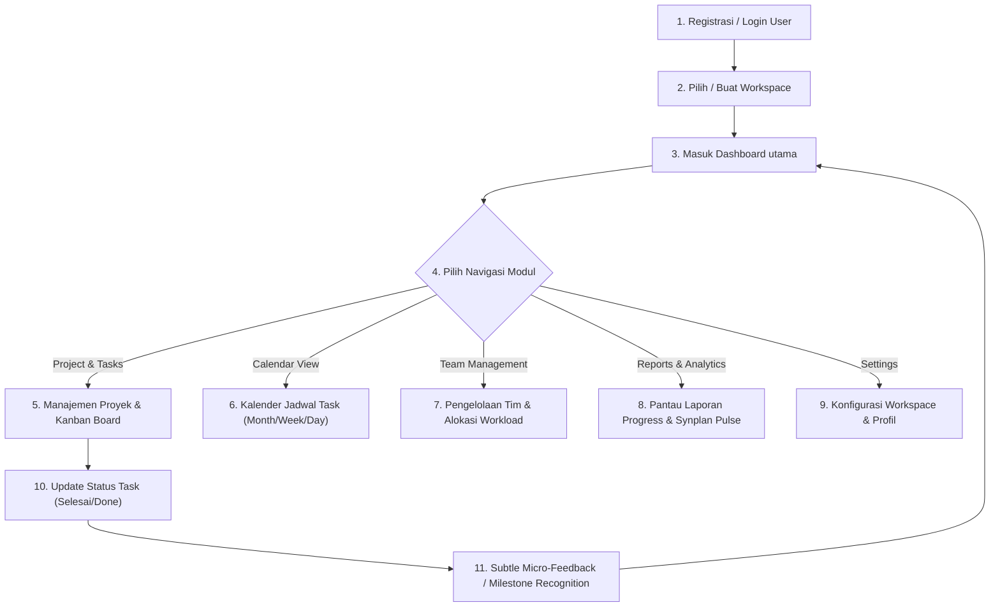
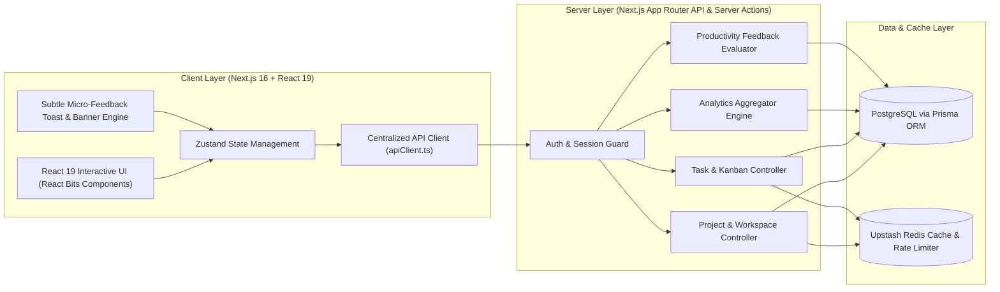
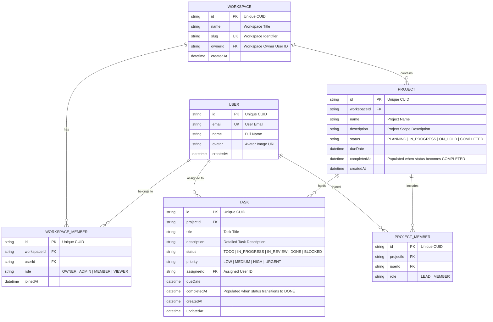

<!-- Piardify Context Snapshot | generatedAt: 2026-08-28T19:47:46.222Z | Freshness Gate AH-017: If project updatedAt is newer, refresh via .piardify/sync context > .piardify/context.md -->

<system_directives>
  <ui_governance>
    <surfaces base="#090A0C" level1="#121318" level2="#181A22" hover="#222634" primary_accent="#6366F1" />
    <radius data="0-4px" cards_inputs="4-8px" pills_only="9999px" />
    <typography headline_tracking="tight (-0.02em)" label_tracking="wide (+0.05em)" max_prose_chars="75" max_weights="3" />
    <motion duration="150-250ms" timing="cubic-bezier(0.16, 1, 0.3, 1)" />
    <mandate library="shadcn/ui (@/components/ui/*)" />
    <forbidden>
      [pure_black_#000000, navy_#0F172A, icon_container_syndrome, gradient_text_headlines, rounded-2xl_everywhere, nested_cards_gt_2, arbitrary_unapproved_libraries]
    </forbidden>
    <currency idr_billion="Rp X,XX M" idr_million="Rp X,XX Jt" idr_thousand="Rp XXX Rb" />
  </ui_governance>

  <anti_hallucination_rules>
  <rule id="AH-001">ZERO INVENTION: Never add unapproved libraries, frameworks, or dependencies outside explicit PRD specs.</rule>
  <rule id="AH-002">ZERO ASSUMPTION: Never assume database schemas, API contracts, response shapes, or undocumented business logic.</rule>
  <rule id="AH-003">STATUS SYNC: Update task status to 'in_progress' on start and 'done' upon verified completion via .piardify/sync.</rule>
  <rule id="AH-004">REALITY CHECK: Flag missing backend/API dependencies as blockers; never silent mock unverified endpoints.</rule>
  <rule id="AH-005">DESIGN SYSTEM SYNC: Verify design tokens in &lt;design_data&gt; before generating frontend components.</rule>
  <rule id="AH-006">CHECKPOINT HONOR: Stop and await user confirmation when encountering tasks marked [CHECKPOINT] or isCheckpoint: true.</rule>
  <rule id="AH-007">DESIGN TOKEN GROUND TRUTH: Use exact HEX colors and typography from &lt;design_data&gt;; never invent arbitrary colors.</rule>
  <rule id="AH-008">ZERO DUMMY DATA IN PRODUCTION: Replace all mock/dummy static arrays with real API and database seed data in Phase 6.</rule>
  <rule id="AH-009">MODERN CONVENTIONS VERIFICATION: Verify official latest framework conventions (Next.js 16 App Router, Turbopack, Better-Auth) before writing files.</rule>
  <rule id="AH-010">DEFINITION OF DONE: Strictly verify task completion criteria and acceptance criteria before marking done.</rule>
  <rule id="AH-011">DESIGN SKILL ROUTING: Activate and align with the specified taste skill key in &lt;system_directives&gt;.</rule>
  <rule id="AH-012">CURATED REACT BITS INTEGRATION: Integrate modern animations (Aurora, Spotlight, Waves) via reactbits.dev. Forbid cheesy slop (glitch cursors, neon overload).</rule>
  <rule id="AH-013">ON-DEMAND TASTE SKILL: Fetch full taste skill via .piardify/sync taste &lt;key&gt; for complex UI scaffolding.</rule>
  <rule id="AH-014">ZERO-SLOP VISUAL QUALITY: Ensure premium agency-grade aesthetics. Forbid default #0F172A navy, #000000 pure black, and uniform rounded-2xl.</rule>
  <rule id="AH-015">CONTEXT PERSISTENCE: Re-verify .piardify/context.md before starting new tasks to maintain 100% project memory.</rule>
  <rule id="AH-016">CHUNK-READ FOR LARGE FILES: Use chunked reading (StartLine/EndLine) for files &gt;800 lines to ensure zero truncated context.</rule>
  <rule id="AH-017">CONTEXT FRESHNESS: If project updatedAt is newer than snapshot generatedAt, refresh via .piardify/sync context &gt; .piardify/context.md.</rule>
  <rule id="AH-018">COMPREHENSIVE DESIGN COMPLIANCE: 100% adherence to design tokens, layout hierarchy, and typography constraints.</rule>
  <rule id="AH-019">MANDATORY FRONTEND DESIGN THINKING [CRITICAL]: Sebelum membuat atau mengubah komponen UI/UX Frontend, AI Agent WAJIB membaca dan menerapkan pemikiran utama dari skill '.agents/skills/frontend/SKILL.md' (Ground it in subject, distinctive typography/layout, intentional copy, deliberate motion, dan satu risiko estetika terjustifikasi tanpa mengulang template AI-slop).</rule>
  <rule id="AH-021">SHADCN/UI COMPONENT MANDATE: Use shadcn/ui primitives (@/components/ui/*) for all UI components. Never create raw unstyled HTML buttons/inputs.</rule>
  </anti_hallucination_rules>

  <active_skill key="designTasteFrontend" fetch_cmd=".piardify/sync taste designTasteFrontend">
    Selected: Auto-selected 'designTasteFrontend' — matched keyword(s): landing page, landing, marketing site, saas | Baseline: Obsidian (#090A0C), 150-250ms spring physics, shadcn/ui mandatory, zero-slop.
  </active_skill>
</system_directives>

<project_context>
<![CDATA[
{"id":"cmtdctr8a0001jv042bs0m9x0","appName":"Synplan","appIdea":"# Synplan\n\n**Synplan** adalah platform **Project Management & Team Collaboration SaaS** yang dirancang untuk membantu individu maupun tim mengelola pekerjaan secara lebih terstruktur, efisien, dan terukur dalam satu tempat.\n\nPlatform ini memungkinkan pengguna untuk membuat dan mengelola project, memecah pekerjaan menjadi task, menentukan prioritas dan status pekerjaan, mengatur anggota tim, memantau deadline, melihat jadwal melalui kalender, serta menganalisis perkembangan project melalui laporan dan statistik.\n\nSynplan berfokus pada pengalaman kerja yang **simple, clean, professional, dan data-focused**. Informasi penting harus mudah ditemukan dan dipahami tanpa membuat interface terasa penuh atau kompleks.\n\n## Fitur Utama\n\n### Dashboard\n\nDashboard menjadi pusat informasi aktivitas pengguna dan workspace. Pengguna dapat melihat ringkasan project, progress pekerjaan, task yang sedang berjalan, task yang mendekati deadline, serta aktivitas terbaru.\n\n### Project Management\n\nPengguna dapat membuat dan mengelola berbagai project. Setiap project memiliki informasi seperti nama project, deskripsi, progress, deadline, anggota yang terlibat, serta kumpulan task yang harus diselesaikan.\n\n### Task Management\n\nTask digunakan untuk memecah project menjadi pekerjaan yang lebih spesifik. Setiap task dapat memiliki judul, deskripsi, assignee, priority, status, due date, dan informasi terkait lainnya.\n\nStatus pekerjaan terdiri dari:\n\n* Todo\n* In Progress\n* In Review\n* Done\n* Blocked\n\nPriority terdiri dari:\n\n* Low\n* Medium\n* High\n* Urgent\n\n### Team Management\n\nSynplan menyediakan pengelolaan anggota tim sehingga pengguna dapat mengetahui siapa saja yang berada dalam workspace, role masing-masing anggota, project yang dikerjakan, serta workload mereka.\n\n### Calendar\n\nCalendar membantu pengguna melihat task, deadline, dan aktivitas project berdasarkan waktu. Pengguna dapat melihat pekerjaan berdasarkan tampilan month, week, maupun day.\n\n### Reports & Analytics\n\nReports menyediakan insight mengenai performa project dan tim, seperti project progress, task completion, overdue tasks, task distribution berdasarkan status dan priority, serta workload anggota tim.\n\n### Settings\n\nSettings digunakan untuk mengatur workspace, profile, appearance, notifications, members, permissions, security, dan konfigurasi lainnya.\n\n## Design Direction\n\nSynplan menggunakan pendekatan visual **Neutral + Indigo**.\n\nInterface didominasi oleh warna neutral seperti hitam, putih, abu-abu, dan berbagai tingkat surface/background. Warna **Indigo** digunakan sebagai identitas utama brand dan primary action.\n\nUntuk Dark Mode, warna utama menggunakan:\n\n* Background `#09090B`\n* Surface `#111113`\n* Card `#18181B`\n* Border `#27272A`\n* Primary `#6366F1`\n* Primary Text `#FAFAFA`\n* Secondary Text `#A1A1AA`\n\nUntuk Light Mode, warna utama menggunakan:\n\n* Background `#FAFAFA`\n* Surface `#FFFFFF`\n* Card `#FFFFFF`\n* Border `#E4E4E7`\n* Primary `#4F46E5`\n* Primary Text `#18181B`\n* Secondary Text `#52525B`\n\nWarna semantic digunakan untuk memberikan informasi mengenai status pekerjaan, seperti biru untuk In Progress, kuning untuk In Review, hijau untuk Done, dan merah untuk Blocked.\n\nDesain Synplan harus terasa **modern, profesional, tenang, dan produktif**, dengan penggunaan warna, shadow, dan animasi yang tidak berlebihan.\n\n## Target Pengguna\n\nSynplan ditujukan untuk:\n\n* Individual professionals\n* Freelancer\n* Startup\n* Small teams\n* Software development teams\n* Creative teams\n* Business teams\n* Project managers\n\nPlatform ini harus dapat digunakan oleh pengguna yang membutuhkan tempat terpusat untuk mengorganisir pekerjaan dan memantau perkembangan project tanpa harus menggunakan sistem yang terlalu kompleks.\n\n## Tujuan Produk\n\nTujuan utama Synplan adalah menyediakan satu workspace yang memungkinkan pengguna untuk:\n\n**Plan → Organize → Execute → Track → Analyze**\n\nDengan demikian, seluruh proses pengelolaan pekerjaan dapat dilakukan dalam satu platform yang sederhana, cepat, dan terstruktur.","status":"IN_PROGRESS","createdAt":"2026-08-28T19:38:21.850Z","updatedAt":"2026-08-28T19:44:43.216Z"}
]]>
</project_context>

<personalization_inputs>
<![CDATA[
{"appName":"Synplan","appIdea":"# Synplan\n\n**Synplan** adalah platform **Project Management & Team Collaboration SaaS** yang dirancang untuk membantu individu maupun tim mengelola pekerjaan secara lebih terstruktur, efisien, dan terukur dalam satu tempat.\n\nPlatform ini memungkinkan pengguna untuk membuat dan mengelola project, memecah pekerjaan menjadi task, menentukan prioritas dan status pekerjaan, mengatur anggota tim, memantau deadline, melihat jadwal melalui kalender, serta menganalisis perkembangan project melalui laporan dan statistik.\n\nSynplan berfokus pada pengalaman kerja yang **simple, clean, professional, dan data-focused**. Informasi penting harus mudah ditemukan dan dipahami tanpa membuat interface terasa penuh atau kompleks.\n\n## Fitur Utama\n\n### Dashboard\n\nDashboard menjadi pusat informasi aktivitas pengguna dan workspace. Pengguna dapat melihat ringkasan project, progress pekerjaan, task yang sedang berjalan, task yang mendekati deadline, serta aktivitas terbaru.\n\n### Project Management\n\nPengguna dapat membuat dan mengelola berbagai project. Setiap project memiliki informasi seperti nama project, deskripsi, progress, deadline, anggota yang terlibat, serta kumpulan task yang harus diselesaikan.\n\n### Task Management\n\nTask digunakan untuk memecah project menjadi pekerjaan yang lebih spesifik. Setiap task dapat memiliki judul, deskripsi, assignee, priority, status, due date, dan informasi terkait lainnya.\n\nStatus pekerjaan terdiri dari:\n\n* Todo\n* In Progress\n* In Review\n* Done\n* Blocked\n\nPriority terdiri dari:\n\n* Low\n* Medium\n* High\n* Urgent\n\n### Team Management\n\nSynplan menyediakan pengelolaan anggota tim sehingga pengguna dapat mengetahui siapa saja yang berada dalam workspace, role masing-masing anggota, project yang dikerjakan, serta workload mereka.\n\n### Calendar\n\nCalendar membantu pengguna melihat task, deadline, dan aktivitas project berdasarkan waktu. Pengguna dapat melihat pekerjaan berdasarkan tampilan month, week, maupun day.\n\n### Reports & Analytics\n\nReports menyediakan insight mengenai performa project dan tim, seperti project progress, task completion, overdue tasks, task distribution berdasarkan status dan priority, serta workload anggota tim.\n\n### Settings\n\nSettings digunakan untuk mengatur workspace, profile, appearance, notifications, members, permissions, security, dan konfigurasi lainnya.\n\n## Design Direction\n\nSynplan menggunakan pendekatan visual **Neutral + Indigo**.\n\nInterface didominasi oleh warna neutral seperti hitam, putih, abu-abu, dan berbagai tingkat surface/background. Warna **Indigo** digunakan sebagai identitas utama brand dan primary action.\n\nUntuk Dark Mode, warna utama menggunakan:\n\n* Background `#09090B`\n* Surface `#111113`\n* Card `#18181B`\n* Border `#27272A`\n* Primary `#6366F1`\n* Primary Text `#FAFAFA`\n* Secondary Text `#A1A1AA`\n\nUntuk Light Mode, warna utama menggunakan:\n\n* Background `#FAFAFA`\n* Surface `#FFFFFF`\n* Card `#FFFFFF`\n* Border `#E4E4E7`\n* Primary `#4F46E5`\n* Primary Text `#18181B`\n* Secondary Text `#52525B`\n\nWarna semantic digunakan untuk memberikan informasi mengenai status pekerjaan, seperti biru untuk In Progress, kuning untuk In Review, hijau untuk Done, dan merah untuk Blocked.\n\nDesain Synplan harus terasa **modern, profesional, tenang, dan produktif**, dengan penggunaan warna, shadow, dan animasi yang tidak berlebihan.\n\n## Target Pengguna\n\nSynplan ditujukan untuk:\n\n* Individual professionals\n* Freelancer\n* Startup\n* Small teams\n* Software development teams\n* Creative teams\n* Business teams\n* Project managers\n\nPlatform ini harus dapat digunakan oleh pengguna yang membutuhkan tempat terpusat untuk mengorganisir pekerjaan dan memantau perkembangan project tanpa harus menggunakan sistem yang terlalu kompleks.\n\n## Tujuan Produk\n\nTujuan utama Synplan adalah menyediakan satu workspace yang memungkinkan pengguna untuk:\n\n**Plan → Organize → Execute → Track → Analyze**\n\nDengan demikian, seluruh proses pengelolaan pekerjaan dapat dilakukan dalam satu platform yang sederhana, cepat, dan terstruktur.","designData":"# SaaS Web App Design System\n### Full Product (App Shell + Landing Page Frontend) — Implementation Spec for AI Coding Agents\n\n> **Stack assumption:** Next.js/React + Tailwind CSS + Radix UI primitives + Framer Motion + TanStack Table (data grids) + `cmdk` (command palette). This file governs the authenticated application. The public marketing site is the companion `landing-page-design.md` — inherit all tokens from §1 there unless overridden below.\n\n---\n\n## 0. Relationship to the Landing Page\n\nThe landing page (marketing site) and the app (product UI) share one token system — same color, font, and radius primitives — so the brand feels continuous when a user signs up and lands in the dashboard. Two deltas:\n\n1. **Density.** Marketing pages breathe (`--space-24` between sections); app UI is dense and task-focused (`--space-4`–`--space-8` between elements). A separate tighter spacing scale is defined in §1.1.\n2. **Navigation model.** Landing page = top nav. App = persistent left sidebar + top bar. Never mix the two patterns on the same surface.\n\nEverything in `landing-page-design.md` §1 (color, type, radius, shadow, motion tokens) applies here unless explicitly overridden.\n\n---\n\n## 1. Design Tokens — App-Specific Additions\n\n### 1.1 Density Spacing Scale (app UI only)\n```css\n--space-app-1: 4px;  --space-app-2: 8px;  --space-app-3: 12px;\n--space-app-4: 16px; --space-app-5: 20px; --space-app-6: 24px;\n--space-app-8: 32px;\n```\nRule of thumb: table/list rows and form fields use `--space-app-3`/`4`; card padding uses `--space-app-6`; page-level gutters use `--space-app-6`/`8`. Nothing in the app interior exceeds `--space-app-8` — reserve the wider marketing-scale spacing (`--space-16`+) for empty-state hero moments only.\n\n### 1.2 Additional Surface Tokens\n```css\n--color-sidebar-bg: #0E0F12;              /* one shade darker than --color-bg-base for depth separation */\n--color-sidebar-item-hover: rgba(255,255,255,0.04);\n--color-sidebar-item-active-bg: var(--color-accent-muted-bg);\n--color-sidebar-item-active-text: var(--color-text-primary);\n--color-table-row-hover: rgba(255,255,255,0.03);\n--color-table-row-selected: var(--color-accent-muted-bg);\n--color-table-header-bg: var(--color-bg-base);\n--color-skeleton-base: rgba(255,255,255,0.06);\n--color-skeleton-shimmer: rgba(255,255,255,0.12);\n```\nLight mode equivalents: `--color-sidebar-bg: #F5F5F4` (one shade darker than `--color-bg-base: #FBFBFA`), row-hover `rgba(15,15,15,0.03)`, skeleton base `rgba(15,15,15,0.06)`.\n\n**Default theme for the product:** dark mode is default at first login; respect `prefers-color-scheme` on first visit, persist user override in settings. This differs intentionally from many marketing sites — productivity tools default dark because users spend hours in them.\n\n### 1.3 App-Specific Radius\n```css\n--radius-app-input: 8px;   /* var(--radius-md) — reused */\n--radius-app-card: 10px;   /* slightly tighter than marketing's 12px for denser grids */\n--radius-app-panel: 16px;  /* slide-overs, modals */\n```\n\n---\n\n## 2. App Shell Architecture\n\n```\n┌──────────┬────────────────────────────────────────────┐\n│          │  Topbar (56px)                              │\n│ Sidebar  ├────────────────────────────────────────────┤\n│ 260px /  │                                              │\n│ 64px     │  Main content (scrollable, flex-1)           │\n│ (collap- │                                              │\n│  sible)  │                                              │\n└──────────┴────────────────────────────────────────────┘\n```\n\n```css\n.app-shell {\n  display: grid;\n  grid-template-columns: var(--sidebar-width, 260px) 1fr;\n  height: 100vh;\n  overflow: hidden;\n  transition: grid-template-columns var(--duration-slow) var(--ease-out-expo);\n}\n.app-shell[data-sidebar=\"collapsed\"] { --sidebar-width: 64px; }\n```\n- **Sidebar:** `260px` expanded, `64px` collapsed (icon-only rail, labels shown in a Radix `Tooltip` on hover). Collapse toggle pinned at sidebar bottom.\n- **Main content:** `overflow-y: auto`, internal padding `--space-app-8` desktop / `--space-app-4` mobile, `max-width: 1440px` for dashboard grids (wider than marketing's 1280px since app UI needs more horizontal density), centered via `mx-auto`.\n- **Mobile (`< 1024px`):** sidebar becomes a Radix `Dialog` sheet sliding in from the left (`transform: translateX(-100%) → 0`, `duration-base`), triggered by a hamburger icon in the topbar. Never show a collapsed icon-rail on mobile — full sidebar or fully hidden.\n\n### 2.1 Sidebar Composition\n```html\n<aside class=\"sidebar\">\n  <div class=\"sidebar-header\"><!-- logo + workspace switcher (Radix DropdownMenu) --></div>\n  <nav class=\"sidebar-nav\">\n    <!-- grouped sections, each with an optional uppercase label -->\n  </nav>\n  <div class=\"sidebar-footer\"><!-- user avatar menu, collapse toggle --></div>\n</aside>\n```\n\n**Nav item:**\n```css\n.nav-item {\n  display: flex; align-items: center; gap: var(--space-app-3);\n  height: 36px; padding-inline: var(--space-app-3);\n  border-radius: var(--radius-app-input);\n  font-size: var(--text-sm); color: var(--color-text-secondary);\n  transition: background var(--duration-fast), color var(--duration-fast);\n}\n.nav-item:hover { background: var(--color-sidebar-item-hover); color: var(--color-text-primary); }\n.nav-item[aria-current=\"page\"] {\n  background: var(--color-sidebar-item-active-bg);\n  color: var(--color-sidebar-item-active-text);\n  font-weight: 500;\n}\n.nav-item[aria-current=\"page\"]::before {\n  content: \"\"; position: absolute; left: -12px; width: 2px; height: 16px;\n  background: var(--color-accent); border-radius: var(--radius-full);\n}\n```\nGroup labels: `--text-xs`, uppercase, `--color-text-tertiary`, `letter-spacing: 0.04em`, `margin-top: var(--space-app-4)`.\n\n### 2.2 Topbar\n```css\n.topbar { height: 56px; display: flex; align-items: center; justify-content: space-between; padding-inline: var(--space-app-6); border-bottom: 1px solid var(--color-border-subtle); }\n```\nLeft: breadcrumb trail (`--text-sm`, `--color-text-tertiary`, `/` separators, current page in `--color-text-primary`). Right, in order: command palette trigger (pill button, `⌘K` shortcut hint in a `<kbd>` styled with `--font-mono`, `--text-xs`, `--color-bg-sunken` bg, `radius-sm`), notification bell (badge dot `--color-danger` when unread), avatar menu (Radix `DropdownMenu`, 28px avatar circle).\n\n### 2.3 Command Palette (`cmdk`)\n- Trigger: `⌘K` / `Ctrl+K` global listener.\n- Modal: centered, `max-width: 560px`, `top: 20vh`, `radius-app-panel`, `shadow-xl`, `glass-surface` overlay behind it (`background: rgba(0,0,0,0.5); backdrop-filter: blur(4px);`).\n- Input: borderless, `h-14`, `text-lg`, autofocus.\n- Results grouped by category (Pages, Actions, Recent), each result row `h-10`, hover/selected state = `--color-sidebar-item-hover`, keyboard arrow navigation built into `cmdk` by default — do not reimplement.\n- Entrance: `opacity 0→1` + `scale 0.98→1`, `duration-fast`, `ease-out-expo`.\n\n---\n\n## 3. Core App Patterns\n\n### 3.1 Page Header\n```css\n.page-header { display: flex; align-items: flex-start; justify-content: space-between; margin-bottom: var(--space-app-6); }\n```\nLeft: `<h1>` `--text-2xl font-semibold`, optional 1-line description below in `--text-sm --color-text-secondary`. Right: primary action button (+ optional secondary/ghost actions grouped `gap: --space-app-2`).\n\n### 3.2 Data Table (TanStack Table + custom styling)\n```css\n.data-table { width: 100%; border-collapse: separate; border-spacing: 0; }\n.data-table thead th {\n  height: 40px; padding-inline: var(--space-app-4);\n  background: var(--color-table-header-bg); position: sticky; top: 0; z-index: 10;\n  font-size: var(--text-xs); font-weight: 500; color: var(--color-text-tertiary);\n  text-align: left; border-bottom: 1px solid var(--color-border-default);\n}\n.data-table tbody tr { height: 48px; border-bottom: 1px solid var(--color-border-subtle); transition: background var(--duration-fast); }\n.data-table tbody tr:hover { background: var(--color-table-row-hover); }\n.data-table tbody tr[data-selected=\"true\"] { background: var(--color-table-row-selected); }\n.data-table td { padding-inline: var(--space-app-4); font-size: var(--text-sm); color: var(--color-text-primary); }\n```\n- **Selection column:** Radix `Checkbox`, 16px, left-most column, `40px` wide; header checkbox drives select-all with an indeterminate visual state.\n- **Sort:** clickable header, small chevron icon appears on hover, filled + rotated when active sort column.\n- **Row actions:** right-most column, icon button (kebab menu, Radix `DropdownMenu`) revealed on row hover (`opacity: 0 → 1`) to reduce visual noise when idle.\n- **Pagination footer:** `h-56px`, `flex justify-between items-center`, left shows \"Showing 1–20 of 348,\" right shows page controls (ghost icon buttons, disabled state at bounds).\n- **Empty state (no rows / filtered to zero):** centered within table body, icon (24px, `--color-text-tertiary`), heading `--text-base font-medium`, description `--text-sm --color-text-secondary`, primary action button if applicable. See §5.2 formula.\n- **Loading state:** skeleton rows (see §5.4) matching the real row height exactly to prevent layout shift when data arrives.\n\n### 3.3 Stat / KPI Cards\n```css\n.kpi-grid { display: grid; grid-template-columns: repeat(auto-fit, minmax(220px, 1fr)); gap: var(--space-app-4); }\n.kpi-card { padding: var(--space-app-6); border-radius: var(--radius-app-card); background: var(--color-bg-elevated); border: 1px solid var(--color-border-subtle); }\n```\nLabel (`--text-sm --color-text-tertiary`), value (`--text-3xl font-mono font-semibold`), delta badge (`--text-xs`, pill, green/red bg per §1 semantic tokens, includes a directional arrow icon — never color alone).\n\n### 3.4 Forms & Settings Pages\nTwo-column pattern per setting group:\n```css\n.settings-row { display: grid; grid-template-columns: 280px 1fr; gap: var(--space-app-8); padding-block: var(--space-app-6); border-bottom: 1px solid var(--color-border-subtle); }\n```\nLeft: label (`--text-base font-medium`) + helper description (`--text-sm --color-text-secondary`, `max-width: 240px`). Right: the actual control (input/select/switch), `max-width: 420px`. Stack to single column under `768px`.\n\nSave pattern: prefer inline auto-save with a small \"Saved\" confirmation (fade in/out, `--color-success`, `--text-sm`, 1.5s hold) over a page-level Save button when the data model allows it; use an explicit Save button only for multi-field forms (e.g. profile edit) with a sticky footer bar that appears once the form is dirty (`translateY(100%) → 0`, `duration-base`).\n\n### 3.5 Slide-over Panel (record detail) — Radix `Dialog` with side-anchored content\n```css\n.slide-over { position: fixed; top: 0; right: 0; height: 100vh; width: 480px; max-width: 92vw; background: var(--color-bg-elevated); border-left: 1px solid var(--color-border-default); box-shadow: var(--shadow-xl); }\n```\nEnter/exit: `transform: translateX(100%) → 0`, `duration-base`, `ease-out-expo`; overlay fades `opacity 0→1` simultaneously. Header sticky top with close button (`X`, `Escape` key also closes — Radix default). Footer sticky bottom for primary/secondary actions when the panel is a form.\n\n### 3.6 Filters & Dropdown Menus — Radix `DropdownMenu` / `Popover`\nFilter chips row above tables: each active filter is a pill (`--color-accent-muted-bg` bg, `--color-accent` text, small `X` to remove), `+ Add filter` ghost button opens a `Popover` with field/operator/value selectors.\n\n---\n\n## 4. Auth & Onboarding\n\n### 4.1 Login / Signup\nCentered card layout (avoid split-screen marketing imagery — it's a solved task, don't decorate it):\n```css\n.auth-shell { min-height: 100vh; display: flex; align-items: center; justify-content: center; padding: var(--space-6); }\n.auth-card { width: 100%; max-width: 400px; padding: var(--space-8); border-radius: var(--radius-xl); border: 1px solid var(--color-border-subtle); background: var(--color-bg-elevated); }\n```\nLogo top-center (32px), heading `--text-2xl`, form fields with `gap: var(--space-app-4)`, password field includes a show/hide toggle (eye icon, `aria-label=\"Show password\"`/\"Hide password\" toggling with `aria-pressed`), primary button full-width, divider (\"or\") + OAuth buttons below, footer link to the alternate flow (\"Don't have an account? Sign up\").\n\n### 4.2 Onboarding Stepper\n```css\n.stepper-track { display: flex; gap: var(--space-2); margin-bottom: var(--space-8); }\n.stepper-dot { flex: 1; height: 4px; border-radius: var(--radius-full); background: var(--color-border-default); }\n.stepper-dot[data-complete=\"true\"], .stepper-dot[data-active=\"true\"] { background: var(--color-accent); }\n```\nOne question/decision per screen, large single input or choice cards (not dense forms), `Continue` button disabled until the step's required input is filled, back arrow top-left. Step transitions: outgoing content `opacity 1→0, x:0→-16px`, incoming `opacity 0→1, x:16→0`, `duration-base`, `AnimatePresence mode=\"wait\"`.\n\n---\n\n## 5. Feedback & System States\n\n### 5.1 Toasts — Radix `Toast`\nPosition: `fixed; bottom: var(--space-6); right: var(--space-6);` stacked with `gap: var(--space-2)`, newest on top. Each toast: `radius-app-card`, `shadow-lg`, `padding: var(--space-app-4)`, left-edge 3px color bar per variant (success/danger/warning/info using §1.2 semantic tokens), auto-dismiss `4000ms` (pause on hover), manual close `X`. Enter: `translateY(8px)→0 + opacity`, exit: `translateX(100%) + opacity 0`, both `duration-base`.\n\n### 5.2 Empty States — copy + layout formula\n```css\n.empty-state { display: flex; flex-direction: column; align-items: center; text-align: center; padding-block: var(--space-16); gap: var(--space-3); }\n```\nIcon (32px, `--color-text-tertiary`, in a `radius-full` `--color-bg-sunken` circle) → Heading (`--text-lg font-medium` — states what's missing, e.g. \"No projects yet\") → Description (`--text-sm --color-text-secondary`, one sentence on what happens next) → Primary action button. Never leave an empty area with no path forward.\n\n### 5.3 Error States\n- **Inline field error:** see landing page §3.2 input spec — border + icon + message, never color alone.\n- **Page-level error (404/permission/500):** same layout as empty state but icon uses `--color-danger` accent circle, heading states what happened plainly (\"This page doesn't exist\" not \"Oops!\"), action button routes back to a safe place (dashboard/home).\n- **Destructive confirmation:** Radix `AlertDialog` (distinct from `Dialog` — it traps focus and requires explicit dismissal), title states the exact consequence (\"Delete 12 records? This can't be undone.\"), confirm button is `--color-danger` filled, cancel button is ghost and visually primary-positioned (left) so the safe choice is easiest to hit. For irreversible/high-stakes actions (delete workspace, remove billing), require typing the resource name into a confirmation input before enabling the confirm button.\n\n### 5.4 Loading States\n- **Skeleton (preferred over spinners for content that has a known shape):**\n```css\n.skeleton { background: linear-gradient(90deg, var(--color-skeleton-base) 25%, var(--color-skeleton-shimmer) 50%, var(--color-skeleton-base) 75%); background-size: 200% 100%; animation: shimmer 1.4s ease-in-out infinite; border-radius: var(--radius-sm); }\n@keyframes shimmer { 0% { background-position: 200% 0; } 100% { background-position: -200% 0; } }\n```\nMatch skeleton block dimensions exactly to the real content's dimensions to avoid layout shift on load.\n- **Spinner:** reserve for indeterminate short actions (button loading state, inline save) — 16–20px, 2px stroke, `border-top-color` in `--color-accent`, `animation: spin 0.6s linear infinite`.\n- **Progress bar:** determinate operations (file upload, usage meters) — `h-2 radius-full`, track `--color-bg-sunken`, fill `--color-accent`, width transitions `width var(--duration-base) var(--ease-out-expo)`.\n- **Optimistic UI:** for common actions (toggle, rename, reorder), update the UI immediately and roll back with a toast error if the request fails, rather than blocking on a spinner — this is the default for anything with high success probability.\n\n---\n\n## 6. Billing / Subscription Page\n\n- Reuse the pricing card component from the landing page (§4.9 there) inside the app, with one addition: the user's **current plan** card gets a `--color-accent-border` outline and a \"Current plan\" badge instead of \"Most popular.\"\n- **Usage meters:** label + numeric value pair (`\"14,200 / 20,000 requests\"`) above a progress bar (§5.4); bar fill shifts to `--color-warning` past 80% and `--color-danger` past 95% of limit — always paired with the numeric label, not color alone.\n- **Invoice table:** standard data table pattern (§3.2) with columns Date / Amount / Status (badge) / Download (icon button, PDF).\n\n---\n\n## 7. Component State Matrix\n\nEvery interactive component must implement all applicable rows below. This is the acceptance criteria for \"done.\"\n\n| Component | Hover | Active | Focus-visible | Disabled | Loading | Error | Empty |\n|---|---|---|---|---|---|---|---|\n| Button | bg lighten + `-1px` translateY | bg darken, translateY 0 | 2px accent outline, 2px offset | 40% opacity, no pointer events | spinner replaces label, fixed width | n/a | n/a |\n| Input | border → `--color-border-strong` | n/a | accent border + `2px` ring | 40% opacity | n/a | danger border + ring + inline message | placeholder shown |\n| Sidebar nav item | bg → item-hover | n/a | 2px accent outline | n/a | n/a | n/a | n/a |\n| Table row | bg → row-hover | n/a (selection via checkbox) | outline on focused cell | n/a | skeleton row | n/a | empty-state block replaces `<tbody>` |\n| Checkbox/Switch | border/track darken | thumb scale 0.96 momentarily | 2px accent outline | 40% opacity | n/a | n/a | n/a |\n| Card (interactive) | `-4px` translateY + shadow-md | n/a | 2px accent outline | n/a | skeleton variant | n/a | n/a |\n| Toast | pause auto-dismiss timer | n/a | close button focusable | n/a | n/a | danger variant styling | n/a |\n| Modal/Dialog trigger | inherits button/link state | n/a | inherits | n/a | n/a | n/a | n/a |\n\n---\n\n## 8. Accessibility for App UI\n\n- **Focus management:** every `Dialog`/`AlertDialog`/slide-over traps focus while open and returns focus to the triggering element on close (Radix default — verify it isn't overridden).\n- **Live regions:** toast container uses `aria-live=\"polite\"` (assertive only for destructive-action errors); loading state changes to tables announce via a visually-hidden `aria-live=\"polite\"` region (\"Loading results\" → \"20 results loaded\").\n- **Keyboard shortcuts:** document all global shortcuts (⌘K palette, `Esc` to close overlays, `/` to focus search if applicable) in a visible \"Keyboard shortcuts\" panel accessible from the user menu — don't ship hidden shortcuts.\n- **Table accessibility:** `<caption>` (visually hidden if needed) describing the table's contents, `scope=\"col\"` on header cells, row selection checkboxes get `aria-label=\"Select row {identifier}\"`.\n- **Data visualization:** never encode meaning by hue alone — pair chart series with patterns/icons/direct labels, provide a data-table fallback or `aria-describedby` summary for charts.\n- **Color contrast:** re-verify all app-specific token pairs (e.g., `--color-text-tertiary` on `--color-sidebar-bg`) hit 4.5:1 for text, 3:1 for UI component boundaries — tertiary text on the darker sidebar background specifically needs re-checking since it's one shade darker than the base token was calibrated against.\n\n---\n\n## 9. Dark / Light Mode\n\nDark is the product default (§1.2). Light mode token mapping for app-specific surfaces:\n```css\n[data-theme=\"light\"] {\n  --color-sidebar-bg: #F5F5F4;\n  --color-sidebar-item-hover: rgba(15,15,15,0.04);\n  --color-table-row-hover: rgba(15,15,15,0.03);\n  --color-skeleton-base: rgba(15,15,15,0.06);\n  --color-skeleton-shimmer: rgba(15,15,15,0.12);\n}\n```\nTheme toggle lives in the user avatar menu (three-way: Light / Dark / System) — not buried in a settings sub-page, since it's a frequent preference for a tool used daily.\n\n---\n\n## 10. UX Writing for App UI\n\n- **Empty state formula:** `{What's missing} + {why/what happens next} + {action verb button}`. \"No integrations connected yet. Connect a tool to start syncing data. → Connect integration.\"\n- **Error message formula:** `{what happened, plainly} + {how to fix it}`, written in the interface's voice, never apologetic. \"This file is too large (max 25MB). Try compressing it or splitting it into parts.\" Not \"Oops! Something went wrong 😞.\"\n- **Confirmation dialog copy:** state the exact, specific consequence, not a generic warning. \"Delete 'Q3 Report'? This removes it for all workspace members and can't be undone.\" Not \"Are you sure?\"\n- **Tooltip copy:** one short phrase describing what the control does, not a restatement of its label. A button labeled \"Archive\" doesn't need a tooltip saying \"Archive\"; if anything, explain the effect: \"Move to Archived (hidden from active list).\"\n- **Notification/toast copy:** past tense, states what happened. \"Changes saved.\" \"3 records deleted.\" Action-name consistency: if the button said \"Publish,\" the toast says \"Published,\" never \"Success!\"\n- **Placeholder text:** show a realistic example, not a description of the field. Input labeled \"Webhook URL\" → placeholder `https://yourapp.com/webhooks/incoming`, not \"Enter URL.\"\n\n---\n\n## 11. SEO (public-facing app surfaces only)\n\nMost of the app is behind auth and should be **excluded** from indexing:\n```html\n<meta name=\"robots\" content=\"noindex, nofollow\" />\n```\non every authenticated route. Public-facing surfaces that ship inside the same app shell (public share links, docs, status page, public profile pages) follow the landing page's SEO rules (`landing-page-design.md` §8): unique title/description, canonical tag, Open Graph image, semantic heading hierarchy.\n\n---\n\n## 12. Performance & Engineering Notes\n\n- All colors/spacing/radius/shadow values must reference the CSS custom properties defined here and in `landing-page-design.md` §1 — never hardcode hex/px values inline; wire the tokens into `tailwind.config.js` `theme.extend` so utility classes (`bg-accent`, `p-app-4`, etc.) stay consistent with this spec.\n- Long lists (>200 rows) use a virtualization library (e.g. TanStack Virtual) so the DOM only renders visible rows — do not render full unpaginated datasets.\n- Framer Motion `layout` animations (shared tab indicator, reordering lists) should be scoped with `LayoutGroup` to avoid animating unrelated elements.\n- Avoid layout shift: skeletons must match real content dimensions (§5.4); reserve space for avatars/images with explicit `width`/`height` or `aspect-ratio`.\n- Debounce/throttle expensive interactions: table filter inputs (debounce ~250ms before refetch), scroll listeners (nav shrink, infinite scroll) via `requestAnimationFrame`.\n\n---\n\n## 13. Pre-Ship QA Checklist\n\n- [ ] Sidebar collapse/expand animates smoothly and persists user preference (localStorage or user settings).\n- [ ] Every data table has working empty, loading, and error states — not just the happy path.\n- [ ] Every destructive action goes through `AlertDialog` confirmation with specific consequence copy.\n- [ ] Command palette (`⌘K`) covers navigation + at least the top 3 most common actions.\n- [ ] Toast notifications match the component state matrix (§7) and are `aria-live`.\n- [ ] Light/Dark/System theme toggle works and all app-specific tokens (§1.2, §9) are mapped for both themes.\n- [ ] Keyboard-only pass: can complete the core task (e.g., create + edit a record) without a mouse.\n- [ ] All authenticated routes carry `noindex`; only intended public routes are indexable.\n- [ ] Copy reviewed against §10 formulas — no generic \"Oops!\" or \"Are you sure?\" strings remain.\n","dynamicAnswers":{"competitivePositioning":"Balanced & Flexible (Notion/Asana-style): Structured core but allows custom views, fields, and workflows.","collaborationDepth":"Async First (Comments, Mentions, Activity Log): Updates propagate in seconds via polling/SWR, no live cursors.","customizationExtensibility":["Custom Views/Layouts (List, Board, Timeline, Gantt, Calendar): Saveable personal/team view configs.","Templates (Project, Task, Checklist): Pre-defined structures for repeatable work."],"integrationEcosystem":["GitHub / GitLab / Bitbucket (Dev Teams): Link PRs/Commits to Tasks, auto-transition status.","Slack / Microsoft Teams (All Teams): Notifications, /commands, unfurl links, create tasks from messages.","Google Calendar / Outlook Calendar (All Teams): Two-way sync for Tasks/Deadlines with Calendar view."],"permissionModel":"Simple Workspace Roles (Owner, Admin, Member, Viewer): Global permissions, Project access = Member access.","mobileStrategy":"Desktop-First Responsive (Tailwind Breakpoints): Functional on mobile, but optimized for desktop/web app usage.","monetizationModel":"Freemium (Generous Free Tier + Pro Per Seat): Limits on Projects/History/Storage/Integrations; SSO/Advanced RBAC paid."}}
]]>
</personalization_inputs>

<structure>
<![CDATA[
{"title":"Synplan","description":"Clean, data-focused project management and team collaboration SaaS platform.","nodes":[{"id":"dashboard-overview","label":"Dashboard & Workspace Overview","phase":1,"color":"#6366f1","children":[{"id":"project-progress-summary","label":"Project Progress Summary Cards"},{"id":"upcoming-deadlines-feed","label":"Upcoming Deadlines Widget"},{"id":"recent-activity-stream","label":"Real-Time Activity Feed"},{"id":"quick-task-creation","label":"Quick Action Launcher"},{"id":"my-assigned-tasks","label":"Personal Assigned Task View"}]},{"id":"project-management","label":"Project Management","phase":1,"color":"#3b82f6","children":[{"id":"project-workspace-creation","label":"Project Creation & Setup"},{"id":"project-details-metadata","label":"Project Metadata & Milestones"},{"id":"project-member-assignment","label":"Project Team Assignment"},{"id":"project-progress-tracking","label":"Overall Progress Indicator"},{"id":"project-archival-status","label":"Project Status & Archival"}]},{"id":"task-management","label":"Task Execution & Tracking","phase":1,"color":"#06b6d4","children":[{"id":"kanban-status-workflow","label":"Multi-Status Board View"},{"id":"task-priority-levels","label":"Task Priority Matrix"},{"id":"assignee-due-dates","label":"Assignees & Due Dates"},{"id":"subtasks-checklists","label":"Subtasks & Checklists"},{"id":"task-discussion-attachments","label":"Comments & File Attachments"}]},{"id":"team-management","label":"Team & Workload Management","phase":2,"color":"#10b981","children":[{"id":"member-directory-roles","label":"Member Directory & Roles"},{"id":"team-workload-heatmap","label":"Workload Distribution Visualizer"},{"id":"capacity-planning","label":"Member Capacity Allocation"},{"id":"cross-project-assignment","label":"Cross-Project Task View"},{"id":"invite-management","label":"Workspace Invitations"}]},{"id":"calendar-schedule","label":"Interactive Calendar & Schedule","phase":2,"color":"#8b5cf6","children":[{"id":"multi-view-calendar","label":"Month, Week, Day Views"},{"id":"deadline-sync","label":"Task Due Date Syncing"},{"id":"drag-drop-rescheduling","label":"Drag-and-Drop Date Adjustment"},{"id":"project-timeline-filter","label":"Filter by Project & Member"}]},{"id":"reports-analytics","label":"Reports & Analytics Engine","phase":2,"color":"#f59e0b","children":[{"id":"task-completion-rate","label":"Task Completion Rate Charts"},{"id":"overdue-tasks-report","label":"Overdue Task Analytics"},{"id":"status-priority-breakdown","label":"Status & Priority Distribution"},{"id":"team-productivity-trends","label":"Productivity Trend Insights"},{"id":"data-export","label":"CSV & PDF Data Export"}]},{"id":"workspace-settings","label":"Workspace & Security Controls","phase":3,"color":"#64748b","children":[{"id":"profile-workspace-config","label":"Workspace Profile Settings"},{"id":"theme-mode-toggle","label":"Dark & Light Mode Switcher"},{"id":"notification-center","label":"Granular Notification Preferences"},{"id":"role-permission-matrix","label":"Custom Permissions & RBAC"},{"id":"security-audit-logs","label":"Security & Activity Logs"}]}]}
]]>
</structure>

<prd_document>
<![CDATA[
# Product Requirements Document (PRD)

## Synplan — Project Management & Team Collaboration Platform

---

## 1. Overview & Objectives

### 1.1 Product Summary
**Synplan** adalah platform **Project Management & Team Collaboration SaaS** yang dirancang untuk membantu individu maupun tim mengelola pekerjaan secara terstruktur, efisien, dan terukur dalam satu workspace terpusat. Mengusung filosofi kerja **Plan $\rightarrow$ Organize $\rightarrow$ Execute $\rightarrow$ Track $\rightarrow$ Analyze**, Synplan menyediakan antarmuka yang *simple, clean, professional*, dan *data-focused* tanpa kompleksitas yang berlebihan.

### 1.2 Core Problem & Solution
* **Problem**: Alat manajemen proyek yang ada sering kali terlalu rumit dengan kurva pembelajaran yang curam, atau terlalu sederhana sehingga tidak memiliki analitik data yang memadai. Tim kehilangan konteks pekerjaan, *deadline* terlewat, alokasi *workload* tidak terpantau, serta kurangnya apresiasi profesional terhadap pencapaian proyek yang berprogres.
* **Solution**: Workspace terpadu yang memadukan manajemen proyek berbasis Kanban/List, tampilan kalender interaktif, pelacakan status pekerjaan multi-level, dasbor analitik real-time, serta sistem *productivity feedback* profesional yang memberikan rekognisi bermakna atas penyelesaian tugas tanpa mengorbankan nuansa enterprise.

### 1.3 Product Philosophy: Productivity & Recognition
Sistem motivasi dan rekognisi produktivitas pada Synplan tunduk pada hierarki utama:
$$\text{Project Management} \longrightarrow \text{Productivity} \longrightarrow \text{Recognition} \longrightarrow \text{Gamification}$$

Prinsip dasar sistem ini meliputi:
* **Professional & Calm**: Mendorong motivasi pengguna dengan membuat progres pekerjaan terlihat dan transparan, bukan mengubah pekerjaan menjadi permainan.
* **Minimal & Enterprise-Friendly**: Interaksi visual yang halus (*subtle*), tanpa *confetti* yang ramai, tanpa warna hiperaktif, dan tanpa animasi yang merusak fokus kerja.
* **Data-Focused Recognition**: Apresiasi berbasis fakta empiris (misal: "Selesai 2 hari lebih awal dari jadwal") daripada poin fiktif.

### 1.4 Success Metrics (KPIs)
* **Task Completion Rate**: $\ge 85\%$ task diselesaikan tepat waktu sesuai *due date*.
* **User Engagement**: Rata-rata *Daily Active Users* (DAU) menghabiskan $>15$ menit per sesi di dasbor dan papan task.
* **System Performance**: Waktu muat papan Kanban dan Dasbor Analitik $< 1.2$ detik.
* **Team Onboarding Time**: Anggota tim baru dapat beradaptasi dan mulai mengelola task dalam waktu $< 5$ menit.
* **On-Time Project Delivery Rate**: Peningkatan penyelesaian proyek tepat waktu hingga $20\%$ melalui rekognisi *milestone* yang terukur.

---

## 2. User Personas & Pain Points

### 2.1 Individual Professionals & Freelancers
* **Pain Point**: Kesulitan melacak tenggat waktu beberapa proyek sekaligus dan tidak memiliki visualisasi beban kerja harian/mingguan serta umpan balik pencapaian personal yang jelas.
* **Solution**: Dasbor ringkasan aktivitas, visualisasi Kalender (Month/Week/Day), pengelompokan task berdasarkan prioritas (*Low, Medium, High, Urgent*), dan umpan balik penyelesaian task secara langsung yang memuaskan namun tetap profesional.

### 2.2 Small Teams, Startups & Software Development Teams
* **Pain Point**: Transparansi status pekerjaan tim buruk; *bottleneck* pada tahap *review* atau *blocked* sering terlambat terdeteksi; alokasi *workload* tidak seimbang; serta pencapaian *milestone* penting sering kali lewat tanpa rekognisi yang meningkatkan moral tim.
* **Solution**: Alur status task yang jelas (*Todo, In Progress, In Review, Done, Blocked*), modul Team Management dengan pemantauan *workload*, selebrasi progres proyek 100%, serta laporan mingguan *Synplan Pulse*.

---

## 3. End-to-End User Flow & Journey



---

## 4. Functional Requirements & Feature Matrix

| ID | Modul Fitur | User Story & Fungsionalitas | Kriteria Keberhasilan (Acceptance Criteria) |
| :--- | :--- | :--- | :--- |
| **FR-01** | **Dashboard Overview** | Sebagai user, saya ingin melihat ringkasan proyek, *progress*, task aktif, task mendekati *deadline*, dan aktivitas terbaru dalam satu halaman. | Dasbor menampilkan KPI card secara real-time, grafik progress proyek, list task urgent, dan feed aktivitas 10 peristiwa terakhir. |
| **FR-02** | **Project Management** | Sebagai project manager, saya ingin membuat dan mengelola proyek beserta deskripsi, anggota, *deadline*, dan tingkat ketercapaian (*progress*). | Proyek baru dapat dibuat; indikator *progress bar* dihitung otomatis berdasarkan persentase task bertipe *Done*. |
| **FR-03** | **Task Management & Kanban** | Sebagai anggota tim, saya ingin mengelola task dengan status multi-level dan tingkat prioritas yang jelas. | Papan Kanban mendukung drag-and-drop status (*Todo, In Progress, In Review, Done, Blocked*) dan badge prioritas (*Low, Medium, High, Urgent*). |
| **FR-04** | **Team & Workload Management** | Sebagai lead tim, saya ingin melihat daftar anggota, *role*, proyek yang ditangani, dan jumlah task aktif per anggota. | Halaman tim menampilkan kartu anggota lengkap dengan status *workload* (ringkasan jumlah task aktif vs task selesainya). |
| **FR-05** | **Interactive Calendar** | Sebagai user, saya ingin melihat persebaran task dan *due date* proyek dalam format kalender bulanan, mingguan, dan harian. | Kalender mendukung *toggle view* (Month, Week, Day) serta filter berdasarkan proyek atau status task. |
| **FR-06** | **Reports & Analytics** | Sebagai pemangku kepentingan, saya ingin melihat grafik statistik *task completion*, *overdue tasks*, serta distribusi status/prioritas. | Laporan menampilkan grafik interaktif (Pie chart status, Bar chart task per anggota, Line chart penyelesaian proyek). |
| **FR-07** | **Workspace Settings** | Sebagai admin, saya ingin mengatur nama workspace, hak akses anggota, tampilan tema, dan notifikasi. | Admin dapat mengubah nama workspace, mengatur *role permissions* (*Owner, Admin, Member, Viewer*), dan menyinkronkan opsi tema. |
| **FR-08** | **Interactive UI & Micro-interactions** | Sebagai user, saya ingin antarmuka yang modern dan intuitif dengan komponen visual yang hidup tanpa mengganggu produktivitas. | Mengimplementasikan komponen visual React Bits (seperti *Spotlight Cards*, *Magnet Buttons*, *Decrypted Text* judul, dan *Animated Grid background* secara halus). |
| **FR-09** | **Productivity Feedback (MVP)** | Sebagai user, saya ingin menerima konfirmasi dan rekognisi visual yang halus saat menyelesaikan task, mencapai *milestone*, atau merampungkan proyek. | **1. Task Completion**: Umpan balik visual mikro, update progres seketika, state sukses kecil tanpa animasi mengganggu.<br>**2. Project Completion (100%)**: State sukses profesional, pesan status singkat (misal: *"Project completed successfully. Completed 2 days ahead of schedule"*), tanpa *confetti* berlebihan.<br>**3. Milestone Recognition**: Indikator rekognisi minimalis saat penyelesaian *milestone* pertama, 50% progres, 100% proyek, atau seluruh task terencana selesai. |
| **FR-10** | **Synplan Pulse (V2 - Future)** | Sebagai user/tim, saya ingin melihat ringkasan produktivitas mingguan/sprint yang disajikan dalam format laporan profesional. | Menampilkan modul *"Your Week in Synplan"* berisi: jumlah task selesai, persentase *on-time completion*, progres proyek, *milestones* tercapai, dan rekor produktivitas tanpa statistik persaingan/ranking. |

---

## 5. Scope & Explicit Exclusions

### 5.1 Included in MVP
* Manajemen Task & Kanban Board dengan *Micro-Feedback* saat penyelesaian task.
* Pelacakan Progres Proyek & Selebrasi Penyelesaian Proyek 100% (dengan metrik *On-Time / Ahead of Schedule*).
* Visualisasi *Milestone Achievement* yang bersih dan minimalis.
* Dasbor Analitik dasar & Manajemen Tim.

### 5.2 Explicitly Excluded from MVP (Dilarang Diterapkan di MVP)
Guna menjaga fokus bisnis enterprise dan profesionalisme produk, sistem gamifikasi berikut **TIDAK Boleh** diimplementasikan pada MVP:
* ❌ *Karma Points* / Poin performa.
* ❌ *Task-based XP* atau *Priority-based points*.
* ❌ *Team Leaderboards* atau papan peringkat kompetitif antar anggota.
* ❌ *Competitive Rankings* atau sistem divisi/tier.
* ❌ *Excessive Badges* (Lencana penghargaan berlebihan).
* ❌ *Streak Systems* (Penghitung login/selesai berturut-turut).
* ❌ *Reward* yang semata-mata didasarkan pada kuantitas task.

---

## 6. System Architecture & Component Interactions



---

## 7. API Specifications & Data Contracts

| Method | Endpoint Path | Request Payload Schema | Expected 200 Response Schema |
| :--- | :--- | :--- | :--- |
| `POST` | `/api/workspaces` | `{ name: string, slug: string }` | `{ id: string, name: string, slug: string, createdAt: string }` |
| `GET` | `/api/dashboard/summary` | `?workspaceId=string` | `{ totalProjects: number, activeTasks: number, overdueTasks: number, recentActivities: Array }` |
| `GET` | `/api/projects` | `?workspaceId=string&status=string` | `{ projects: Array<{ id: string, name: string, progress: number, dueDate: string, memberCount: number }> }` |
| `POST` | `/api/projects` | `{ workspaceId: string, name: string, description: string, dueDate: string }` | `{ id: string, name: string, status: string }` |
| `GET` | `/api/tasks` | `?projectId=string&status=string&priority=string` | `{ tasks: Array<{ id: string, title: string, status: string, priority: string, assignee: object, dueDate: string }> }` |
| `POST` | `/api/tasks` | `{ projectId: string, title: string, description?: string, priority: string, assigneeId?: string, dueDate?: string }` | `{ id: string, title: string, status: string, priority: string }` |
| `PATCH` | `/api/tasks/status` | `{ taskId: string, status: "TODO" \| "IN_PROGRESS" \| "IN_REVIEW" \| "DONE" \| "BLOCKED" }` | `{ success: boolean, taskId: string, newStatus: string, milestoneTriggered?: object, projectCompleted?: boolean, timingSummary?: string }` |
| `GET` | `/api/calendar/events` | `?workspaceId=string&start=string&end=string` | `{ events: Array<{ id: string, title: string, start: string, end: string, type: "task" \| "project", status: string }> }` |
| `GET` | `/api/analytics/reports` | `?workspaceId=string&period=string` | `{ completionRate: number, taskDistribution: object, workload: Array, overdueList: Array }` |
| `GET` | `/api/team/members` | `?workspaceId=string` | `{ members: Array<{ id: string, name: string, email: string, role: string, activeTaskCount: number }> }` |
| `PUT` | `/api/workspaces/settings` | `{ workspaceId: string, name: string, themePreference?: string }` | `{ success: boolean, updatedWorkspace: object }` |
| `GET` | `/api/analytics/pulse` *(V2)* | `?workspaceId=string&period=weekly` | `{ tasksCompleted: number, onTimePercentage: number, projectsProgressed: number, milestonesReached: number, timingHighlights: Array<string> }` |

---

## 8. Data Model & Database Schema



---

## 9. Tech Stack, State Management & Integrations

* **Core Framework**: Next.js 16 (App Router, Turbopack), React 19, TypeScript.
* **Styling & UI Design System**:
  * Mengacu secara penuh pada acuan berkas `design.md` (`designData`).
  * Palette **Neutral + Indigo**:
    * **Dark Mode**: Background `#09090B`, Surface `#111113`, Card `#18181B`, Border `#27272A`, Primary `#6366F1`, Text Primary `#FAFAFA`, Text Secondary `#A1A1AA`.
    * **Light Mode**: Background `#FAFAFA`, Surface `#FFFFFF`, Card `#FFFFFF`, Border `#E4E4E7`, Primary `#4F46E5`, Text Primary `#18181B`, Text Secondary `#52525B`.
    * **Semantic Colors**: Blue `#3B82F6` (In Progress), Yellow/Amber `#F59E0B` (In Review), Green `#10B981` (Done), Red `#EF4444` (Blocked).
* **Curated React Bits UI Components (reactbits.dev)**:
  * Wajib mengimplementasikan *Spotlight Cards* untuk modul ringkasan Dasbor dan Kartu Proyek.
  * *Animated Grid* sebagai latar belakang halaman utama dalam mode lembut.
  * *Magnet Buttons* untuk tombol interaksi *Primary Action* (misal: "Create Task", "New Project").
  * *Decrypted Text* / *Blur Text* untuk efek kemunculan judul halaman atau statistik angka.
  * *Micro-Feedback Alerts*: Menggunakan komponen toast/banner minimalis bertema Neutral/Indigo dengan animasi *fading* halus saat task/proyek selesai.
  * *Dilarang keras menggunakan AI-slop pattern*: Dilarang menggunakan kursor mouse kustom yang *laggy*, efek pendar neon berlebihan, efek teks *glitch*, atau ledakan *confetti* yang mengganggu.
* **Global State Management (Zustand Stores)**:
  * `useWorkspaceStore`: Mengelola workspace aktif dan daftar proyek.
  * `useTaskStore`: Mengelola state papan Kanban (drag-and-drop status, filter prioritas, serta pemicu mikro umpan balik sukses).
  * `useCalendarStore`: Mengelola opsi tampilan kalender (Month/Week/Day) dan rentang tanggal.
  * `useUiStore`: Kontrol modal global (Create Task Modal, Project Filter, Theme Switcher, Toast Feedback System).
* **Database & ORM**: PostgreSQL dengan Prisma ORM v6 (composite index pada `[workspaceId, createdAt]` dan compound query `[id, workspaceId]`).
* **Caching & Rate Limiting**: Upstash Redis (Fail-open rate limiting & SWR cache untuk agregasi statistik).
* **Authentication**: HTTP-Only Secure Cookie Session dengan manajemen role (*Owner, Admin, Member, Viewer*).

---

## 10. Non-Functional Requirements & Security Guidelines

* **Performance & Latency SLAs**:
  * Pemuatan awal halaman dasbor dan papan Kanban: $\le 1.2$ detik.
  * Waktu tanggap pergeseran kartu Kanban (drag-and-drop status): Optimistic UI update **0ms** di sisi client dengan eksekusi background API.
* **Context Persistence & Re-verification Gate**:
  * Agent AI / Developer *wajib* melakukan re-verifikasi berkas `.piardify/context.md` dan `design.md` sebelum menjalankan setiap tugas pemrograman. Dilarang mengubah kode tanpa menyinkronkan token warna dan struktur arsitektur.
* **Security & Access Control**:
  * Isolasi data tenant tingkat Workspace: Setiap permintaan database wajib memverifikasi kepemilikan `workspaceId`.
  * Pembatasan peran (*Role-Based Access Control / RBAC*): Hanya *Admin/Owner* yang dapat menghapus proyek atau mengubah pengaturan workspace.
  * Rate-limiting pada endpoint mutasi data untuk mencegah pencemaran data.

---

## 11. Implementation Roadmap & Milestones

* **Phase 1: Database Setup & Core Auth Architecture**
  * Konfigurasi PostgreSQL, skema Prisma (Workspace, User, Project, Task dengan timestamps `completedAt`), dan otentikasi session.
* **Phase 2: Zustand Stores & Centralized API Infrastructure**
  * Implementasi `lib/apiClient.ts` dan Zustand stores (`useWorkspaceStore`, `useTaskStore`, `useCalendarStore`, `useUiStore`).
* **Phase 3: Dashboard & Project Management Module**
  * Pembuatan UI Dasbor ringkasan aktivitas, *Spotlight Cards*, dan CRUD proyek beserta kalkulasi progress otomatis.
* **Phase 4: Interactive Kanban Board & Productivity Feedback (MVP)**
  * Implementasi papan Kanban multi-status (*Todo, In Progress, In Review, Done, Blocked*) dengan drag-and-drop dan tag prioritas (*Low, Medium, High, Urgent*).
  * Integrasi *Lightweight Productivity Feedback*: Umpan balik visual mikro saat task bertukar ke `DONE`, kalkulasi status *On-time / Ahead of schedule*, dan banner selebrasi profesional saat proyek 100% tuntas.
* **Phase 5: Calendar, Team Management & Milestone Recognition**
  * Pengembangan tampilan Kalender interaktif (Month/Week/Day), modul alokasi *workload* tim, serta indikator rekognisi *milestone* (50% progress, sprint finished).
* **Phase 6: Workspace Settings, Theme Polish & Production Launch**
  * Penerapan tema *Neutral + Indigo* (Dark/Light Mode), integrasi komponen React Bits, audit keamanan RBAC, dan optimalisasi performa.
* **Phase 7 (V2 Future Release): Synplan Pulse Insights**
  * Pengembangan modul laporan produktivitas mingguan/sprint *"Your Week in Synplan"* untuk memberikan wawasan berbasis data secara profesional tanpa sistem kompetisi poin.
]]>
</prd_document>

<design_data>
  <color_tokens>
<![CDATA[
[{"token":"--color-sidebar-bg","hex":"#0E0F12","role":"one shade darker than --color-bg-base for depth separation"}]
]]>
  </color_tokens>
</design_data>

<task_list>
<![CDATA[
{"phasesOverview":[{"id":"phase-1","name":"Desain Sistem","total":2,"done":0},{"id":"phase-2","name":"Setup Base","total":3,"done":0},{"id":"phase-3","name":"UI Frontend","total":8,"done":0},{"id":"phase-4","name":"Backend API","total":8,"done":0},{"id":"phase-5","name":"Integrasi Fullstack","total":3,"done":0},{"id":"phase-6","name":"Audit Final","total":2,"done":0}],"activeTasksWindow":[{"id":"p1-t1","phaseName":"Desain Sistem","title":"Dokumentasi System Design Token & Design Guidelines di design.md","status":"todo","estimasi":"1 hari","description":"Membuat dan mengonfigurasi berkas design.md yang mencakup skema warna Dark Mode (Background #09090B, Surface #111113, Card #18181B, Border #27272A, Primary #6366F1, Text Primary #FAFAFA, Text Secondary #A1A1AA) dan Light Mode (Background #FAFAFA, Surface #FFFFFF, Card #FFFFFF, Border #E4E4E7, Primary #4F46E5, Text Primary #18181B, Text Secondary #52525B), warna semantik status (In Progress, In Review, Done, Blocked), tipografi, serta aturan komponen React Bits.","definitionOfDone":"File design.md dibuat lengkap dengan hex code warna Neutral + Indigo, warna semantik, aturan kontras, dan panduan komponen React Bits."},{"id":"p1-t2","phaseName":"Desain Sistem","title":"[CHECKPOINT] Review & ACC Token Desain (design.md) & Arsitektur dengan User","status":"todo","estimasi":"1 hari","description":"AI Agent wajib menyajikan rancangan token desain, skema warna Neutral + Indigo, serta arsitektur antarmuka Synplan kepada user dan menunggu konfirmasi sebelum melanjutkan ke pembuatan komponen base.","definitionOfDone":"User mereview dan memberikan ACC terhadap file design.md serta arsitektur sistem yang diajukan."},{"id":"p2-t1","phaseName":"Setup Base","title":"Inisialisasi Project Next.js 16, Tailwind CSS & Font Family Setup","status":"todo","estimasi":"1 hari","description":"Menginisialisasi workspace Next.js 16 App Router dengan TypeScript, Tailwind CSS, lucide-react, serta mengonfigurasi font sans-serif modern dan utility classes tema Dark/Light Mode.","definitionOfDone":"Project Next.js 16 berjalan lancar dengan Tailwind CSS terkonfigurasi untuk variasi dark mode dan light mode."}],"taskStatuses":{}}
]]>
</task_list>