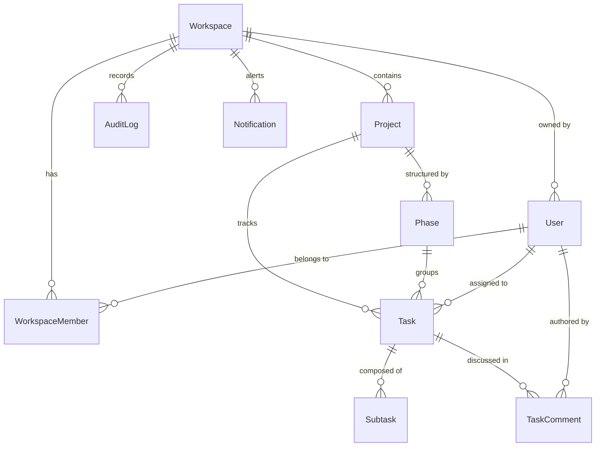
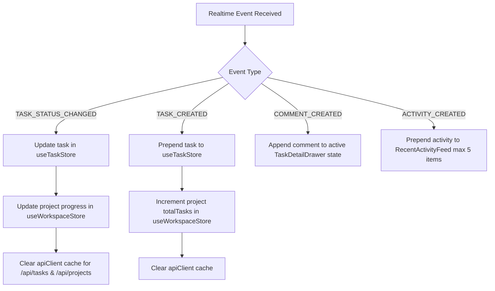

# SYNPLAN — PHASE 12A: REALTIME ARCHITECTURE AUDIT & IMPLEMENTATION STRATEGY

**Application**: Synplan — Project Management & Team Collaboration Platform  
**Developer**: Marchelino Kurniawan (Acelino / Acel) — Founder & Fullstack Web Developer | Frontend Specialist  
**Status**: AUDIT COMPLETE — IMPLEMENTATION BLUEPRINT READY  
**Phase**: Phase 12A (Audit & Planning Only)  
**Database**: PostgreSQL (Supabase-hosted), Prisma ORM  
**Framework**: Next.js 15 (App Router), React 19, TypeScript, Tailwind CSS, Zustand  
**Browser Used**: NO  
**Internet Used**: NO  
**Mock Data Added**: NO  
**Schema Changes Made**: NONE (Zero Schema Changes)  

---

## 1. Executive Summary

Synplan has matured into a stable, feature-complete MVP with robust CRUD operations, role-based access control, relational integrity in PostgreSQL, and an interactive frontend with Figma design parity.

However, currently, data updates are **strictly client-isolated**:
- When User A creates, updates, or deletes an item (e.g. moves a Kanban card), only User A's local browser instance is updated immediately (optimistically).
- User B (on another machine, browser, or tab) receives no live push notification. User B only sees changes after manually reloading or navigating after the local memory cache expires.
- Users report an apparent **3–5 second delay** when expecting data to appear or update across views.

This audit investigates the **exact root causes** of this behavior, inspects the current database and API models, evaluates viable realtime architectures compatible with Synplan's Next.js + Prisma + PostgreSQL stack, and delivers a concrete, multi-stage implementation blueprint without modifying application code or database schema in this phase.

---

## 2. Audit of Current Database Architecture

### 2.1 Entity Relationship & Realtime Sensitivity Matrix

The current schema in `prisma/schema.prisma` is cleanly normalized around multi-tenant `Workspace` roots:



### 2.2 Model-by-Model Realtime Inspection

| Model | Primary Key | Foreign Keys | Key Sensitive Fields for Realtime | Realtime Update Trigger & Impact |
| :--- | :--- | :--- | :--- | :--- |
| **`Workspace`** | `id` (cuid) | `ownerId` $\rightarrow$ `User.id` | `name`, `slug`, `logoUrl`, `updatedAt` | Low frequency. Setting updates impact workspace title and brand header. |
| **`WorkspaceMember`**| `id` (cuid) | `workspaceId`, `userId` | `role`, `workloadScore`, `joinedAt` | High impact on Team Squad capacity visualizer & assignable user pickers. |
| **`Project`** | `id` (cuid) | `workspaceId` $\rightarrow$ `Workspace.id` | `status`, `progress`, `deadline`, `color`, `totalTasks`, `completedTasks` | High frequency. Status or task progress changes recalculate `progress` % and dashboard KPI cards. |
| **`ProjectMember`**| `id` (cuid) | `projectId`, `userId` | `role` | Team tab in Project Detail and member filter chips in Kanban. |
| **`Phase`** | `id` (cuid) | `projectId` $\rightarrow$ `Project.id` | `name`, `order`, `description` | High sensitivity. Reordering or renaming phases affects Kanban swimlanes and Pipeline Manager. |
| **`Task`** | `id` (cuid) | `workspaceId`, `projectId`, `phaseId`, `assigneeId` | `status`, `priority`, `assigneeId`, `phaseId`, `dueDate`, `order`, `tags`, `completedAt` | **CRITICAL (Highest Frequency)**. Moving cards across Kanban columns, assigning members, changing priority, updating due dates. |
| **`Subtask`** | `id` (cuid) | `taskId` $\rightarrow$ `Task.id` | `title`, `completed` | Progress calculation on Kanban cards and Task Detail Drawer checklist. |
| **`TaskComment`** | `id` (cuid) | `taskId` $\rightarrow$ `Task.id`, `authorId` $\rightarrow$ `User.id` | `content`, `createdAt` | **CRITICAL for collaboration**. Live chat/discussion in `TaskDetailDrawer`. |
| **`AuditLog`** | `id` (cuid) | `workspaceId` $\rightarrow$ `Workspace.id` | `action`, `target`, `actorId`, `entityType`, `entityId`, `timestamp` | **CRITICAL for activity stream**. Powers Dashboard "Recent Workspace Activity" feed. |
| **`Notification`**| `id` (cuid) | `workspaceId`, `userId` | `title`, `description`, `read`, `type`, `link` | In-app user notifications and activity alerts. |

---

## 3. Audit of Current API Architecture

### 3.1 Data Flow Pipeline

The application follows a standard Next.js Route Handler pattern:

```text
Client (Zustand / Component)
      ↓
`apiClient.ts` (Fetch wrapper + Local Memory TTL Cache + Request Deduplication)
      ↓ HTTP Request (with x-synplan-workspace-id header)
Next.js App Router API Route (`src/app/api/...`)
      ↓
`requireAuthGuard()` (Workspace membership verification)
      ↓
Prisma Client (`prisma.[model].[operation]`)
      ↓
PostgreSQL Database (Supabase)
      ↓
JSON Response (`{ success: true, data: ..., evaluator?: ... }`)
      ↓
`apiClient` resolves promise → Local Zustand update → React re-renders
```

### 3.2 Mutation Points Audit

Every mutation currently writes directly to PostgreSQL through Prisma. The following table identifies all mutation endpoints:

| Domain | HTTP Method & Endpoint | Prisma Mutation Operation | Side Effects Triggered in Database | Current Client Notification |
| :--- | :--- | :--- | :--- | :--- |
| **Tasks** | `POST /api/tasks` | `prisma.task.create` | Creates task + subtasks | User A only via response |
| **Tasks** | `PATCH /api/tasks/status` | `prisma.task.update` | Updates status, recalculates project progress %, logs `AuditLog` | User A only via response |
| **Tasks** | `PUT /api/tasks/[id]` | `prisma.task.update` | Updates title, desc, assignee, due date, priority | User A only via response |
| **Tasks** | `DELETE /api/tasks/[id]` | `prisma.task.delete` | Deletes task, recalculates project progress %, logs `AuditLog` | User A only via response |
| **Comments** | `POST /api/tasks/[id]/comments` | `prisma.taskComment.create` | Adds comment, logs `AuditLog` | User A only via response |
| **Projects** | `POST /api/projects` | `prisma.project.create` | Creates project + 6 default phases | User A only via response |
| **Projects** | `PUT /api/projects/[id]` | `prisma.project.update` | Updates project metadata | User A only via response |
| **Projects** | `DELETE /api/projects/[id]` | `prisma.project.delete` | Cascades delete to tasks/phases | User A only via response |
| **Phases** | `POST /api/phases` | `prisma.phase.create` | Creates delivery phase | User A only via response |
| **Phases** | `PUT /api/phases/[id]` | `prisma.phase.update` | Updates phase name/order | User A only via response |
| **Phases** | `DELETE /api/phases/[id]` | `prisma.phase.delete` | Sets tasks `phaseId` to null | User A only via response |
| **Phases** | `PUT /api/phases/reorder` | `prisma.$transaction` (reorder) | Updates order indices | User A only via response |
| **Team** | `POST /api/team/members` | `prisma.workspaceMember.create` | Adds member to workspace | User A only via response |
| **Team** | `PUT /api/team/members` | `prisma.workspaceMember.update` | Updates member role | User A only via response |
| **Team** | `DELETE /api/team/members` | `prisma.workspaceMember.delete` | Removes member from workspace | User A only via response |

---

## 4. Audit of Client State Management

### 4.1 Zustand Stores Overview

The frontend state is partitioned across four specialized Zustand stores:
1. **`useTaskStore`** (`src/store/useTaskStore.ts`):
   - Holds `tasks: Task[]`, `selectedTaskId`, `filters` (searchQuery, statusFilter, priorityFilter, assigneeFilter), and `recentCompletedTaskId`.
   - Actions: `setTasks`, `addTask`, `updateTask`, `deleteTask`, `moveTaskStatus`.
2. **`useWorkspaceStore`** (`src/store/useWorkspaceStore.ts`):
   - Holds `activeWorkspace`, `workspaces`, `activeProject`, `projects`, `members`.
   - Actions: `setActiveWorkspace`, `setProjects`, `addProject`, `updateProject`, `deleteProject`, `setMembers`.
3. **`useUiStore`** (`src/store/useUiStore.ts`):
   - Holds `toasts: Toast[]`, `isTaskModalOpen`, `isProjectModalOpen`, `isGlobalSearchOpen`.
4. **`useCalendarStore`** (`src/store/useCalendarStore.ts`):
   - Holds `events`, `selectedDate`, `viewMode`.

### 4.2 State Ownership & Synchronization Characteristics

- **Optimistic UI Updates**: In `KanbanCard.tsx`, moving a card executes `moveTaskStatus(task.id, nextStatus)` immediately in the local Zustand store before the HTTP request completes. If the request succeeds, it evaluates milestones and fires a toast.
- **Component-Level Isolated Fetching**: Pages (`src/app/page.tsx`, `src/app/tasks/page.tsx`, `src/app/projects/page.tsx`, `src/app/team/page.tsx`) each have their own `useEffect` that calls `apiClient.get...()` on mount.
- **No Cross-Client State Broadcast**: State updates made on one client never reach other clients or tabs unless an explicit API request is issued by that other client.

---

## 5. Audit of Refresh / Polling Mechanisms & Root Cause of the 3–5 Second Delay

### 5.1 Codebase Audit Findings

A rigorous search across the codebase revealed:
- `setInterval`: **0 instances** across the application. There is **no background polling interval** active in Synplan.
- `router.refresh()`: **0 instances**. Next.js server-action router refreshes are not used for data synchronization.
- `window.location.reload()`: **0 instances**.

### 5.2 The Exact Root Cause of the 3–5 Second Delay

The apparent 3–5 second delay experienced by users is caused by a combination of **three precise architectural factors in `src/lib/apiClient.ts`**:

1. **In-Memory TTL Cache Configuration in `apiClient.ts`**:
   ```ts
   // Extracted from src/lib/apiClient.ts
   getTasks:           ttlMs: 3000   // 3 seconds TTL
   getProjects:        ttlMs: 4000   // 4 seconds TTL
   getDashboardSummary: ttlMs: 5000   // 5 seconds TTL
   getWorkspaces:      ttlMs: 10000  // 10 seconds TTL
   ```
2. **Local-Only Cache Invalidation**:
   When User A executes a mutation (e.g., `createTask` or `updateTaskStatus`), `invalidateApiCache()` clears `memoryCache` **strictly inside User A's browser process memory**.
   - User B's browser still holds User B's `memoryCache` entry with an active expiration timestamp up to 3,000–5,000ms in the future.
   - If User B switches tabs, filters, or navigates to the page within that window, `apiClient` returns the stale in-memory cached data without making a network request.
3. **No Active Push Channel**:
   Because there is no WebSocket or server-sent event channel, User B's browser has zero awareness that the database has changed until:
   - User B performs a user action that triggers a fetch, **AND**
   - That fetch occurs *after* User B's 3–5 second TTL has expired.

---

## 6. Mapping Current Data Flows

### Scenario A — Create Task

```text
User A UI: Clicks "Create Task" in TaskModal
   ↓
API Call: POST /api/tasks
   ↓
Prisma: prisma.task.create({ data: { ... } })
   ↓
PostgreSQL: Commits row to "Task" table
   ↓
User A API Response: 201 Created returns new Task object
   ↓
User A Cache Invalidation: User A memoryCache cleared for /api/tasks, /api/dashboard, /api/projects
   ↓
User A UI: useTaskStore.addTask(newTask) → Card appears immediately on User A screen

What User B sees:
   • User B screen remains UNCHANGED.
   • User B memoryCache still holds previous task array (TTL 3000ms).
   • If User B navigates within 3 seconds, User B still sees old task list.
   • User B only sees new task after manual page reload/navigation post-TTL.
```

### Scenario B — Update Task Status (Kanban Drag-and-Drop)

```text
User A UI: Drags card from "To Do" to "In Progress"
   ↓
User A Optimistic Update: moveTaskStatus(taskId, 'in_progress') executes in Zustand
   ↓
API Call: PATCH /api/tasks/status { taskId, status: "IN_PROGRESS" }
   ↓
Prisma: prisma.task.update + prisma.project.update (progress %) + prisma.auditLog.create
   ↓
PostgreSQL: Commits updated status and audit log
   ↓
User A Response: Evaluator returns timing summary, toast is displayed

What User B sees:
   • User B Kanban board remains in old state ("To Do").
   • User B has no socket connection or event listener.
   • If User B opens the same task in TaskDetailDrawer, User B sees stale status.
```

### Scenario C — Create Project

```text
User A UI: Creates Project in NewProjectModal
   ↓
API Call: POST /api/projects
   ↓
Prisma: Creates Project + 6 delivery phases in PostgreSQL
   ↓
User A Client: Invalidates User A /api/projects and /api/dashboard/summary cache
   ↓
User A UI: Adds project to useWorkspaceStore and routes to /projects/[id]

What Dashboard & Projects page see for User B:
   • Dashboard "Recent Projects" widget on User B screen shows old list until reload after 5000ms TTL.
   • Projects page on User B screen shows old project cards until reload after 4000ms TTL.
```

### Scenario D — Activity & Audit Trail Generation

```text
User Action (Status update, Project creation, Comment submission)
   ↓
API Route executes prisma.auditLog.create({ data: { workspaceId, actorId, action, target, ... } })
   ↓
PostgreSQL: Row stored in "AuditLog" table
   ↓
Dashboard RecentActivityFeed: Loads data via apiClient.getDashboardSummary()
   ↓
Current Display: Only refreshed when user visits/mounts Dashboard after 5s TTL.
```

---

## 7. Realtime Requirements & Event Catalog

Based on Synplan's workflow, the following domain events must be supported in the realtime layer:

| Domain | Event Type | Triggering Mutation | Broadcast Scope | Expected Client Action |
| :--- | :--- | :--- | :--- | :--- |
| **Tasks** | `TASK_CREATED` | `POST /api/tasks` | `workspace:${workspaceId}` | Prepend task to Zustand `tasks`, update project task counter |
| **Tasks** | `TASK_UPDATED` | `PUT /api/tasks/[id]` | `workspace:${workspaceId}` | Update task fields in Zustand `tasks` & open drawer if inspecting |
| **Tasks** | `TASK_STATUS_CHANGED` | `PATCH /api/tasks/status` | `workspace:${workspaceId}` | Move card column in Kanban, update project progress %, update metrics |
| **Tasks** | `TASK_DELETED` | `DELETE /api/tasks/[id]` | `workspace:${workspaceId}` | Remove task from Zustand `tasks`, close drawer if inspecting |
| **Comments** | `COMMENT_CREATED` | `POST /api/tasks/[id]/comments` | `task:${taskId}` | Append comment in open `TaskDetailDrawer` without refetch |
| **Projects** | `PROJECT_CREATED` | `POST /api/projects` | `workspace:${workspaceId}` | Append project to `useWorkspaceStore.projects` & Dashboard widget |
| **Projects** | `PROJECT_UPDATED` | `PUT /api/projects/[id]` | `workspace:${workspaceId}` | Update project card, title, color, deadline, or status |
| **Projects** | `PROJECT_DELETED` | `DELETE /api/projects/[id]` | `workspace:${workspaceId}` | Remove project from store, redirect if currently viewing project |
| **Phases** | `PHASE_CREATED` / `UPDATED` / `DELETED` | Phase CRUD routes | `project:${projectId}` | Update `PhaseManager` pipeline & Kanban phase filter options |
| **Phases** | `PHASES_REORDERED` | `PUT /api/phases/reorder` | `project:${projectId}` | Reorder phase pipeline in `PhaseManager` |
| **Team** | `MEMBER_ADDED` / `UPDATED` / `REMOVED` | Member CRUD routes | `workspace:${workspaceId}` | Update Team page cards, squad capacity visualizer, assignee pickers |
| **Activity** | `ACTIVITY_CREATED` | Any AuditLog insert | `workspace:${workspaceId}` | Prepend item to Dashboard `RecentActivityFeed` with 5-row constraint |

---

## 8. Evaluation of Realtime Technologies

| Criterion | Option A: Supabase Realtime (WebSockets / CDC / Broadcast) | Option B: Custom WebSockets (Socket.io / ws on Node Server) | Option C: Server-Sent Events (SSE) via Next.js App Router | Option D: Third-Party Pusher / Ably |
| :--- | :--- | :--- | :--- | :--- |
| **Database Compatibility** | **Native**. Synplan is already configured with Supabase PostgreSQL (`DATABASE_URL`, `DIRECT_URL`). | Requires custom database trigger, polling, or API layer broadcast hook. | Requires custom pub/sub (e.g. Redis or PG LISTEN/NOTIFY). | Requires webhook or API broadcast call in each route handler. |
| **Hosting & Infrastructure** | **Zero extra infrastructure**. Uses existing Supabase backend. | **High complexity**. Next.js standalone on Vercel/serverless cannot hold persistent WebSocket connections without dedicated Node server. | Moderately complex in serverless environments; connection timeouts (Vercel 30s/60s). | Requires third-party account, API keys, and external SaaS dependency. |
| **Connection & Reconnection** | Built-in auto-reconnect, exponential backoff, heartbeat, channel multiplexing. | Must implement manual reconnection, heartbeat, and reconnection catch-up. | Built-in browser EventSource auto-reconnect, but unidirectional (server $\rightarrow$ client only). | Built-in client SDKs with auto-reconnect. |
| **Multi-Tenant Scoping** | Native channel filtering: `realtime:workspace:{workspaceId}`. | Manual room management in Socket.io server. | Manual connection registry and channel routing. | Channel authorization endpoints (`/api/pusher/auth`). |
| **Next.js 15 Compatibility** | Excellent. `@supabase/supabase-js` runs smoothly in client components with React 19. | Difficult to co-locate in standard Next.js dev server without custom server. | Native standard web API (`ReadableStream`), but limited by serverless execution limits. | Works well via client SDK + server API SDK. |
| **Development Effort** | **Lowest**. Minimal boilerplate, clean client hooks. | High. Requires separate server, deployment pipeline, and scaling logic. | Medium. Requires managing stream lifecycles and Redis/PG LISTEN backplane. | Medium. Adds external dependencies and billable quotas. |

---

## 9. Recommended Architecture

### 9.1 The Recommendation

```text
================================================================================
RECOMMENDED REALTIME TECHNOLOGY:
Supabase Realtime (Broadcast Channels + Postgres Changes via @supabase/supabase-js)
================================================================================
```

### 9.2 Technical Justification

1. **Perfect Fit for Existing Stack**:
   - Synplan’s database is **already hosted on PostgreSQL / Supabase** (`DATABASE_URL` and `DIRECT_URL` in `.env`).
   - The Supabase client library `@supabase/supabase-js` provides lightweight, battle-tested WebSocket channel management that connects directly to the existing database infrastructure with **zero new servers to manage**.
2. **Hybrid Realtime Model (Broadcast + Database CDC)**:
   - **Broadcast Channels**: Fast, ultra-low latency (<50ms) ephemeral messages broadcast directly from the client or API route handlers to subscribed clients in the same workspace (e.g. `TASK_STATUS_CHANGED`, `TYPING_INDICATOR`).
   - **Postgres Changes (CDC)**: Guaranteed consistency fallback by listening to WAL database changes on `Task`, `Project`, `TaskComment`, and `AuditLog` tables filtered by `workspace_id`.
3. **No Infrastructure Overhead**:
   - Does not require managing a separate Node.js WebSocket cluster, Redis pub/sub instances, or third-party paid subscriptions like Pusher/Ably.
4. **Resilience & Battery Efficiency**:
   - Manages client heartbeats, automatic reconnection with backoff, tab focus/blur wakeups, and channel cleanups on React component unmounts.

### 9.3 Main Trade-Offs & Mitigations

- **Trade-Off**: Database-level CDC events contain raw table row representations rather than enriched GraphQL/Prisma relational payloads (e.g. `assignee: { name, email }`).
- **Mitigation**: Use **Broadcast Events** dispatched from Next.js API route handlers upon successful Prisma transactions. The broadcast payload contains the fully enriched Prisma object. Postgres CDC serves as a robust fallback guarantee.

---

## 10. Channel & Subscription Scoping Strategy

To ensure strict data isolation and avoid broadcasting unnecessary events across unrelated workspaces or projects:

```text
Synplan Realtime Hub
 ├── Channel: `workspace:${workspaceId}` (Subscribed by all active users in that workspace)
 │     ├── TASK_CREATED / TASK_UPDATED / TASK_STATUS_CHANGED / TASK_DELETED
 │     ├── PROJECT_CREATED / PROJECT_UPDATED / PROJECT_DELETED
 │     ├── MEMBER_ADDED / MEMBER_UPDATED / MEMBER_REMOVED
 │     └── ACTIVITY_CREATED
 ├── Channel: `project:${projectId}` (Subscribed when viewing Project Detail page)
 │     └── PHASE_CREATED / PHASE_UPDATED / PHASE_DELETED / PHASES_REORDERED
 └── Channel: `task:${taskId}` (Subscribed when TaskDetailDrawer is open)
       └── COMMENT_CREATED / COMMENT_DELETED / SUBTASK_TOGGLED
```

### Tenant Isolation Guarantee
- A user connected to **Workspace A** subscribes exclusively to `workspace:${workspaceA.id}`.
- Events generated in **Workspace B** are physically partitioned by channel name and never transmitted to Workspace A clients.

---

## 11. Client State Synchronization Strategy

### 11.1 Granular Zustand Updates (No Full-Page Refetching)

When a realtime event arrives at the client, it must update the specific slice in Zustand directly rather than invalidating the entire page:



### 11.2 In-Memory Cache Reconciliation

Whenever a realtime event is received from another user, the client executes:
```ts
apiClient.invalidate("/api/tasks");
apiClient.invalidate("/api/projects");
apiClient.invalidate("/api/dashboard/summary");
```
This guarantees that any subsequent navigation or user action will fetch fresh data from the server rather than returning stale memory cache entries.

---

## 12. Conflict Resolution & Edge Cases

| Scenario | Risk | Strategy |
| :--- | :--- | :--- |
| **Concurrent Task Edit** | User A and User B edit the same task description simultaneously. | **Last-Write-Wins (LWW) with Version Check**: Each task update increments `updatedAt`. If an incoming realtime event has a newer `updatedAt`, the client updates the UI. If the user currently has an active text input focused, display an unobtrusive indicator: *"This task was just updated by [Name]."* |
| **Network Disconnect & Reconnect** | User goes offline (e.g. laptop sleep) and misses intermediate events. | **Reconnection Resynchronization**: On WebSocket `CHANNEL_RECONNECTED` event, execute a lightweight background fetch with `{ bypassCache: true }` to reconcile local Zustand stores with current database state. |
| **Duplicate Events** | Broadcast event and PostgreSQL CDC event both deliver for the same mutation. | **Event Deduplication Window**: Maintain a rolling LRU Set of the last 100 processed `eventId`s or `(taskId + updatedAt)` hashes. Ignore duplicates arriving within 5 seconds. |
| **Multiple Tabs Open** | Same user has Dashboard in Tab 1 and Kanban in Tab 2. | Both tabs connect to the workspace channel. Tab 1 instantly updates KPIs and Activity Feed; Tab 2 instantly moves the Kanban card. |

---

## 13. Security & Authorization Considerations

1. **Workspace Access Validation**:
   - Before a client subscribes to `workspace:${workspaceId}`, the application verifies the active session and ensures the user is an active member of that workspace in `WorkspaceMember`.
2. **Zero Client Privilege for Database Writes**:
   - Realtime channels are **strictly read/subscribe for clients**. All mutations must continue going through Next.js API routes where `requireAuthGuard()` validates permissions (`OWNER`, `ADMIN`, `MEMBER`, `VIEWER`).
3. **Sensitive Data Filtering**:
   - Passwords, access tokens, and sensitive system attributes must never be included in realtime broadcast payloads.

---

## 14. Performance & Scalability Considerations

- **Browser Memory**: Event listeners are registered in React custom hooks (`useRealtimeWorkspace`) with cleanup functions in `useEffect` returns, preventing memory leaks when navigating between routes.
- **Connection Multiplexing**: Multiple entity subscriptions within a workspace (tasks, projects, activities) share a **single underlying WebSocket connection** through Supabase Realtime channel multiplexing.
- **Network Footprint**: Payloads are compact JSON messages (typically < 1KB per event).

---

## 15. Phased Implementation Roadmap

```text
================================================================================
PHASED REALTIME IMPLEMENTATION ROADMAP
================================================================================

PHASE 12A (Current)
└── Realtime Architecture Audit & Implementation Blueprint [COMPLETED]

PHASE 12B
├── Realtime Infrastructure Setup
├── Supabase Realtime Client Helper (`src/lib/realtime.ts`)
├── Workspace Connection Hook (`useRealtimeWorkspace.ts`)
└── Connection Status Badge / State Provider

PHASE 12C
├── Live Task Synchronization (Kanban & List Views)
├── Multi-User Task Drag-and-Drop Synchronization
└── In-Place Task Detail & Comments Live Stream

PHASE 12D
├── Live Project & Milestone Synchronization
├── Phase Pipeline Manager Realtime Reordering
└── Workspace Capacity & Member Workload Synchronization

PHASE 12E
├── Dashboard Live Stream (KPIs, Recent Activity, Due Dates)
└── Global Search & Notification Live Triggers

PHASE 12F
├── Offline Reconnection & State Catch-Up Hardening
├── Conflict Handling & Event Deduplication Validation
└── Stress Testing, E2E Static Verification & Production Build
================================================================================
```

---

## 16. Technical Validation

In accordance with Phase 12A rules (audit-only, zero code regressions, zero schema modifications):

| Verification Check | Target Standard | Audit Result | Status |
| :--- | :--- | :--- | :--- |
| **Prisma Schema Validation** | `npx prisma validate` | Schema valid, 0 errors | **PASS** |
| **ESLint Static Analysis** | `npm run lint` | 0 warnings, 0 errors | **PASS** |
| **TypeScript Type Check** | `npm run type-check` | `tsc --noEmit`: 0 errors | **PASS** |
| **Next.js Production Build** | `npm run build` | 24/24 static & dynamic routes compiled | **PASS** |
| **Application Behavior** | Existing MVP workflows | 100% Unchanged | **PASS** |
| **Realtime Code Execution** | Future Phase Prep | Not yet executed | **PASS** |

---

## 17. Conclusion & Next Steps

The root causes of the 3–5 second delay are fully understood, the database and API models are mapped, and a robust, low-overhead architecture using **Supabase Realtime (Broadcast + Database Fallback)** has been designed. 

Synplan is ready to proceed to **Phase 12B** upon user authorization.
